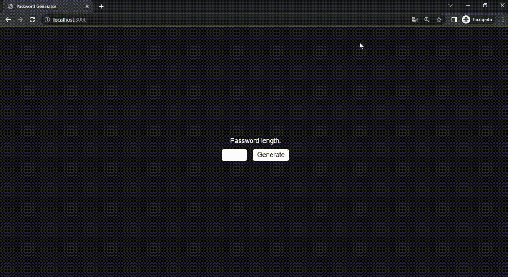

# Password Generator

a fairly simple password generator created with go

## Screenshots



## API Reference

#### Generate Password

```http
  GET /gen?length=<lenght>
```

| Parameter | Type  | Description                |
| :-------- |:------| :------------------------- |
| `length` | `int` | character size |

## Running

[](https://repl.it/github/fzbian/password-generator-api)

To start the server you only have to start the following command
```
go get .
go run main.go
```

### Acknowledgements
Thanks [AndresXLP](https://www.github.com/AndresXLP) for guiding me in my learning process

## Technologies

* echo (v4.10.0)